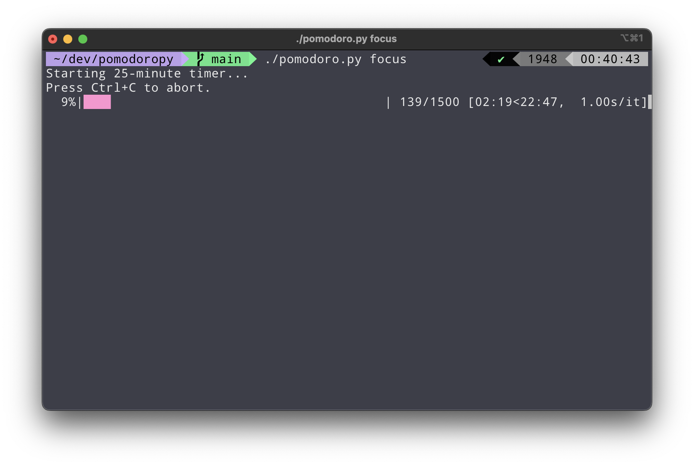

# PomodoroPy Timer

A simple command-line Pomodoro timer built with Python. It includes visual progress tracking, sound notifications, and desktop notifications on Windows and macOS.



### Prerequisites

- Python 3.6 or higher
- Pip

### Installation

1. Clone the repository:

```bash
git clone git@github.com:fabiocore/pomodoropy.git && cd pomodoropy
```

2. Install the required packages:

```bash
pip install -r requirements.txt
```

### Usage

Run the timer with one of the following options:

- `./pomodoro.py focus` for a 25-minute focus timer
- `./pomodoro.py short-break` for a 7.5-minute short break timer
- `./pomodoro.py long-break` for a 15-minute long break timer
- `./pomodoro.py XX` for a custom XX-minute timer